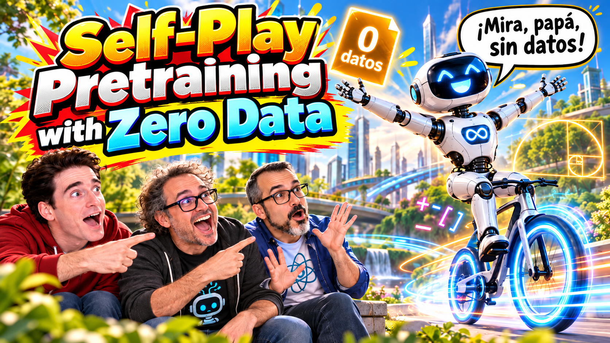

# Entrenar modelos de lenguaje sin datos

- [ Spotify](https://open.spotify.com/episode/2drJKI4zA3YNR4q1rl41FH?si=_9B1Q5YwQOKmi8UUtCDbfA)
- [ Youtube](https://youtu.be/TH8UH78JMCU)
- [ Ivoox](https://go.ivoox.com/rf/181938119)
- [ Apple Podcasts](https://podcasts.apple.com/us/podcast/entrenar-modelos-de-lenguaje-sin-datos/id1669083682?i=1000794058648)

Hoy tratamos el paper Self-Play Pretraining with Zero Data, que muestra un ingenioso método para poder entrenar
modelos de lenguaje sin usar datos.

Participan en la tertulia: Paco Zamora, Josu Gorostegui y Guillermo Barbadillo.

Recuerda que puedes enviarnos dudas, comentarios y sugerencias en: <https://twitter.com/TERTUL_ia>